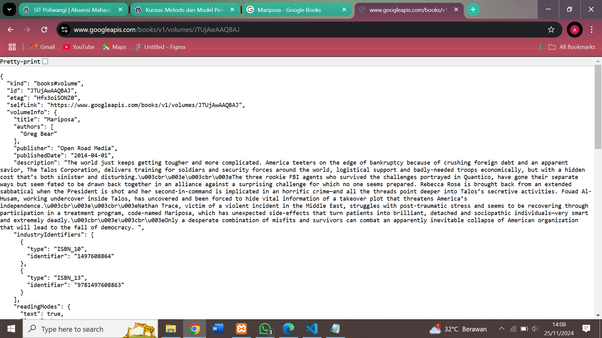
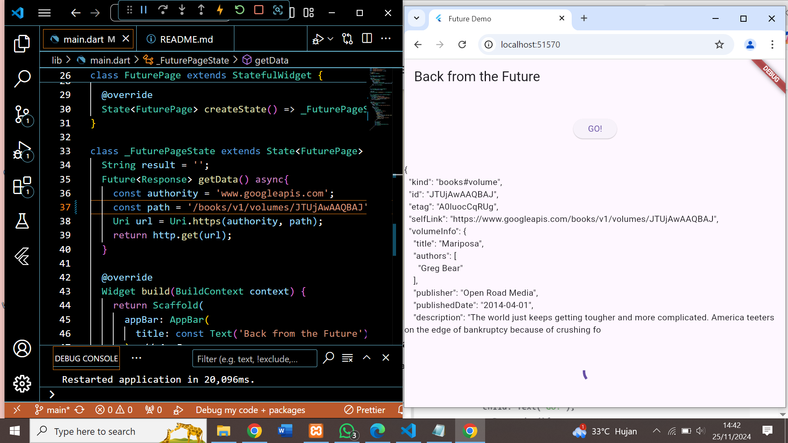
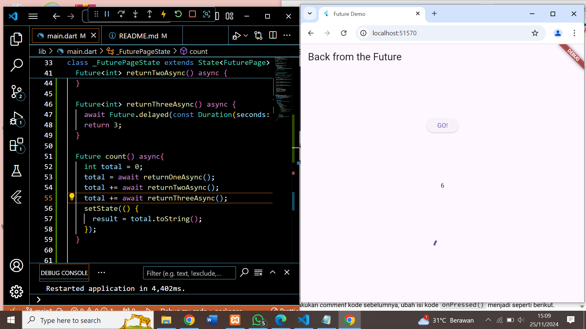
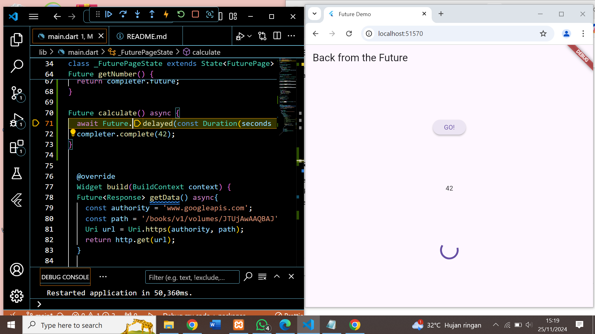
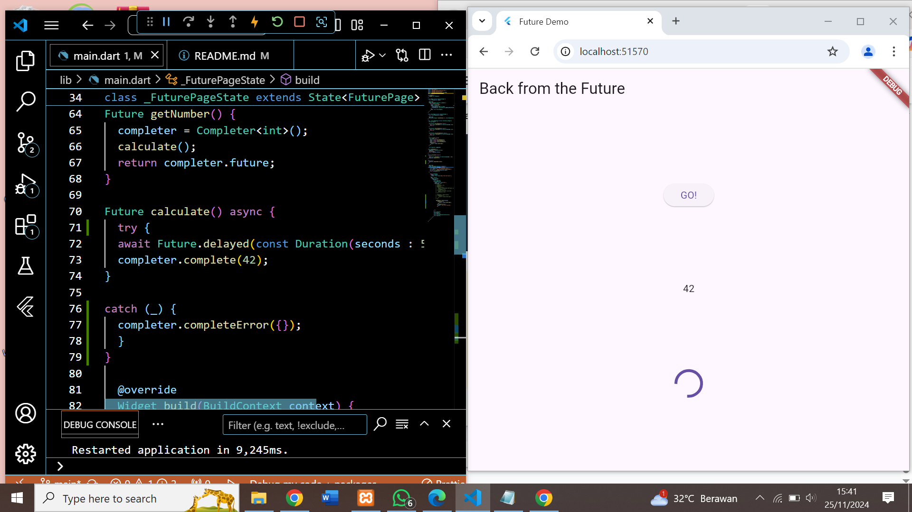
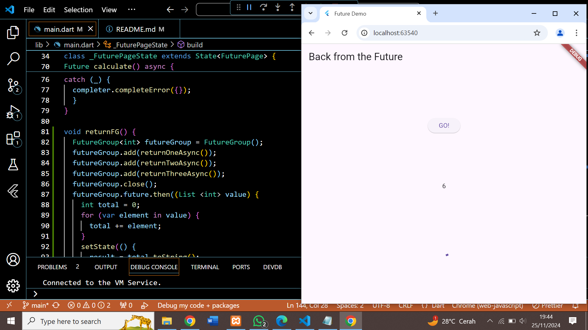
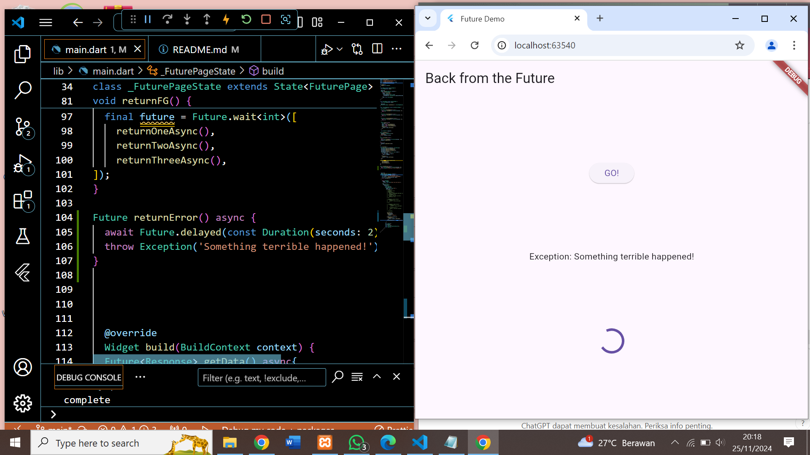
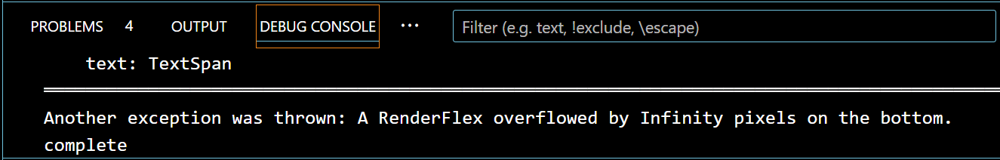
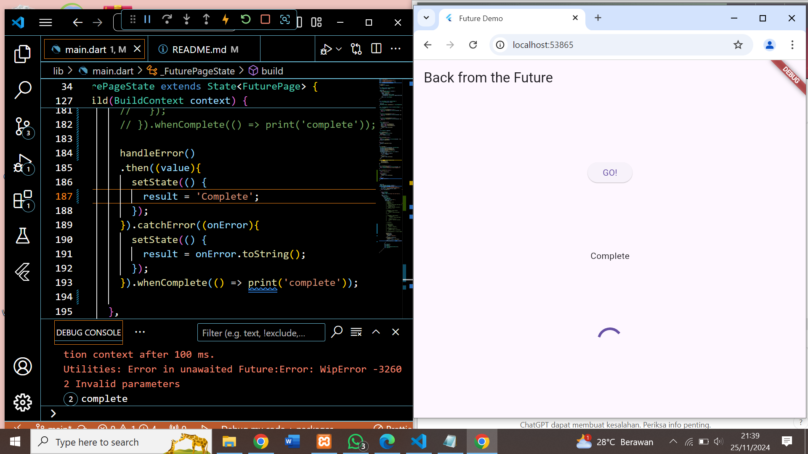

nama    :Aisya Dwi Anggita
NIM : 362358302085
kelas   :2B TRPL
Pemrograman Asynchronous

praktikum 1 mengunudh data dari web service (API)

1. mencari judul buku di google books

2. menampilkan isi dari praktikum sebelumnya

- Substring adalah metode atau fungsi dalam banyak bahasa pemrograman yang digunakan untuk mengambil bagian tertentu dari sebuah string (sub-bagian string). Fungsi ini biasanya menerima parameter awal (index) dan akhir (opsional) untuk menentukan bagian string yang ingin diambil.
- catchError biasanya merujuk pada mekanisme penanganan error (kesalahan) dalam bahasa pemrograman.

3. menggunaka await/async untuk menghindari callbacks
- W11:Soal 4

-Langkah 1 :
Kode tersebut mensimulasikan operasi yang membutuhkan waktu tertentu dengan penundaan menggunakan Future.delayed. Hal ini berguna dalam mengelola proses asinkron dalam aplikasi.
-Langkah 2 : 
Kode tersebut adalah fungsi asinkron dalam bahasa Dart yang menghitung total nilai yang diperoleh dari tiga fungsi returnOneAsync, returnTwoAsync, dan returnThreeAsync. Fungsi ini juga memperbarui tampilan (UI) dengan memanfaatkan setState untuk mengubah nilai variabel result.

4. Menggunakan Completer di Future
-W11:Soal 5

-Jelaskan maksud kode langkah 2 tersebut-
Kode pada langkah 2 bertujuan untuk membuat Future secara manual menggunakan Completer. Menunda hasil dengan menunggu selama 5 detik. Dan menyelesaikan Future dengan nilai 42 menggunakan completer.complete.

5. Ganti method calculate()

- 

Jelaskan maksud perbedaan kode langkah 2 dengan langkah 5-6 tersebut!
- Langkah 5 :
Kode tersebut adalah fungsi asinkron bernama calculate, yang menggunakan blok try-catch untuk menangani kemungkinan kesalahan saat menjalankan operasi asinkron.
- Langkah 6 :
Kode tersebut adalah contoh penggunaan Future, yang memanfaatkan metode then dan catchError untuk menangani hasil sukses atau error dari operasi asinkron.

6. Memanggil Future secara paralel
W11:soal 7

W11:Soal 8
-Jelaskan maksud perbedaan kode langkah 1 dan 4!
langkah 1
pada file main.dart ditambahka method "returnFG()" kedalam class FuturePageState yang mengguanakan FutureGroup umtuk menangani beberapa operasi asynchronous secara bersamaan dan menghitung total hasilnya.
langkah 2
pada onPresssed hapus atau nonaktifkan kode sebelumnya dan panggil method returnFG() yang telah ditambahkan pada langkah 1 untuk menangani logika pemrosesan asynchrounus.
langkah 3
menjalankan aplikasi denga perintah run dan perhatikan hasilnya yang berupa angka 6 muncul dalam wktu 3 detik,lebih cepat dibanding praktikum sebelumnya yang membutuhkan waktu 9 detik
langkah 4
Mengganti penggunaan FutureGroup dengan Future.wait mengubah cara penanganan operasi asynchronous
PERBEDAAN
Future.wait
-Sintaks lebih sederhana dan langsung.
-Cocok jika jumlah Future sudah diketahui.
FutureGroup
-Fleksibel untuk menambah Future secara dinamis saat runtime.
-Berguna untuk skenario di mana jumlah operasi asynchronous tidak diketahui sebelumnya.

7. Menangani Respon Error pada Async Code
W11:soal 9

debug console

W11:Soal 10
handle error

